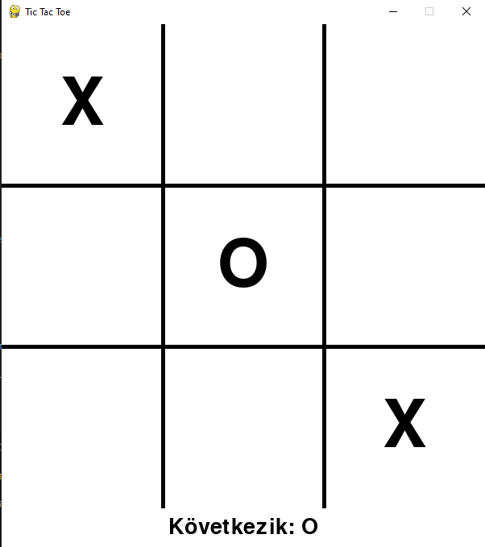

# Tic Tac Toe – Pygame-based Game

This is a simple graphical [Tic Tac Toe](https://en.wikipedia.org/wiki/Tic-tac-toe) game built using the [Pygame](https://www.pygame.org/news) library. The game alternates turns between two players (X and O), and displays the winner or a draw.

## 🕹️ Gameplay

- Players take turns clicking on the grid squares.
- The goal is to place three identical marks (X or O) in a row, column, or diagonal.
- The game shows when someone wins or if it’s a draw.
- The status bar at the bottom indicates whose turn it is or who has won.

## 🧱 Structure

- **Pygame window**: 3x3 grid with an additional 50-pixel bottom bar for messages.
- **Two font sizes**:
  - Larger font for game marks (`X`, `O`)
  - Smaller font for status messages
- **Main functions**:
  - `draw_board()` – renders the X/O marks
  - `check_winner()` – checks for a winning condition
  - `draw_message()` – shows the next turn or the winner

## 🛠️ Installation & Running

### 1. Requirements

- [Python 3](https://www.python.org/)
- [Pygame](https://www.pygame.org/news)

Install with pip:
```bash
pip install pygame
```

### 2. Running the game

Save the file as `tic_tac_toe.py`, then run:

```bash
python tic_tac_toe.py
```

## 🧠 Features Overview

- Full click detection in the grid
- Simple win/draw checking
- Graphical updates after every turn
- Also prints result in the console (win/draw)

## 📷 Screenshot



## 📄 License

This project is free to use for learning purposes.

---

**Have fun playing! 🎮**

---

# Tic Tac Toe – Pygame alapú amőba játék

Ez egy egyszerű, grafikus felületű [Tic Tac Toe](https://en.wikipedia.org/wiki/Tic-tac-toe) (avagy amőba) játék, amelyet a [Pygame](https://www.pygame.org/news) könyvtár segítségével valósítottunk meg. A program két játékos (X és O) között váltogatja a köröket, és kijelzi a győztest vagy a döntetlent.

## 🕹️ Játékmenet

- A játékosok egymás után kattintanak a mezőkre.
- A cél: három azonos jel (X vagy O) egy sorban, oszlopban vagy átlóban.
- A program kijelzi, ha valaki nyert vagy ha döntetlen lett a játék.
- Az állapotjelző sáv alul mutatja, hogy ki következik, vagy ki nyert.

## 🧱 Felépítés

- **pygame ablak**: 3x3-as rács, plusz 50 pixel magas alsó sáv az üzeneteknek.
- **Két betűméret**:
  - Játékjelekhez (`X`, `O`): nagyobb méret
  - Állapotüzenethez: kisebb méret
- **Főbb függvények**:
  - `rajzol_tabla()` – kirajzolja az X/O jeleket
  - `ellenor()` – ellenőrzi, van-e győztes
  - `uzenet_rajzol()` – kiírja, ki következik vagy ki nyert

## 🛠️ Telepítés és futtatás

### 1. Követelmények

- [Python 3](https://www.python.org/)
- [Pygame](https://www.pygame.org/news)

Telepítés pip-pel:
```bash
pip install pygame
```

### 2. A játék futtatása

Mentés pl. `tic_tac_toe.py` néven, majd:

```bash
python tic_tac_toe.py
```

## 🧠 Funkciók összefoglalása

- Teljes körű kattintásérzékelés a rácsban
- Egyszerű ellenőrzés győztesre és döntetlenre
- Grafikus megjelenítés minden frissítéskor
- Konzolra is kiírja az eredményt (győzelem/döntetlen)

## 📷 Képernyőkép


## 📄 Licenc

Ez a projekt szabadon felhasználható tanulási célokra.

---

**Kellemes játékot! 🎮**